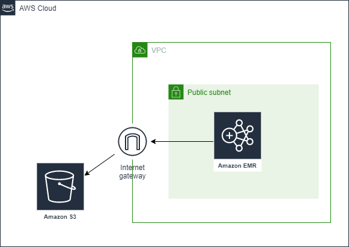

#### Components
- four S3 buckets
    - one bucket for input files
    - one bucket for output files
    - one bucket for storing log files
    - one bucket for storing bootstrap files
- SSH key
- two security groups
    - one for master node with following ingress rules
        - port 22 for SSH
        - self referencing to permit inbound connections so that any resources associated with the security group can communicate with other resources within the same security group
    - one for slave node with following ingress rules
        - port 22 for SSH
        - self referencing 

#### Visualized




#### Note on CLI command

- use the `aws emr create-cluster` command
```
aws emr create-cluster \
    --name <cluster_name> \
    --use-default-roles \
    --release-label emr-5.28.0  \
    --instance-count 3 \
    --applications Name=Spark Name=Zeppelin  \
    --bootstrap-actions Path="s3://bootstrap.sh" \
    --ec2-attributes KeyName=<Key-pair-file-name>, SubnetId=<subnet-Id> \
    --instance-type m5.xlarge \
    --log-uri s3:///emrlogs/
```
- options:
    - `--name`: user-defined name for cluster
    - `--release-label`: version of EMR to use
    - `--instance-count`: the number of instances. One instance is assigned the role primary, while the rest are reserved for secondary instances
    - `--application`: list of applications to pre-install, e.g. Hadoop, Spark, Zeppelin, Ganglia, Hive, Hue, etc.
    - `--bootstrap-actions`: specify the path to a file containing commands for bootstrapping, e.g. setting environment variables
    - `--ec2-attributes`: since the cluster will be launched within an EC2-VPC, provide the subnet Id and name of, e.g., `.pem` key file
    - `--instance-type`: type of instance to use
    - `--log-uri`: s3 bucket to store EMR logs


#### References
- [Amazon VPC options for EMR](https://docs.aws.amazon.com/emr/latest/ManagementGuide/emr-clusters-in-a-vpc.html)
- [EMR Getting started tutorial](https://docs.aws.amazon.com/emr/latest/ManagementGuide/emr-gs.html#emr-getting-started-clean-up)
- [CLI command: create-cluster](https://awscli.amazonaws.com/v2/documentation/api/latest/reference/emr/create-cluster.html)
- [View web interfacs hosted on Amazon EMR clusters](https://docs.aws.amazon.com/emr/latest/ManagementGuide/emr-web-interfaces.html)